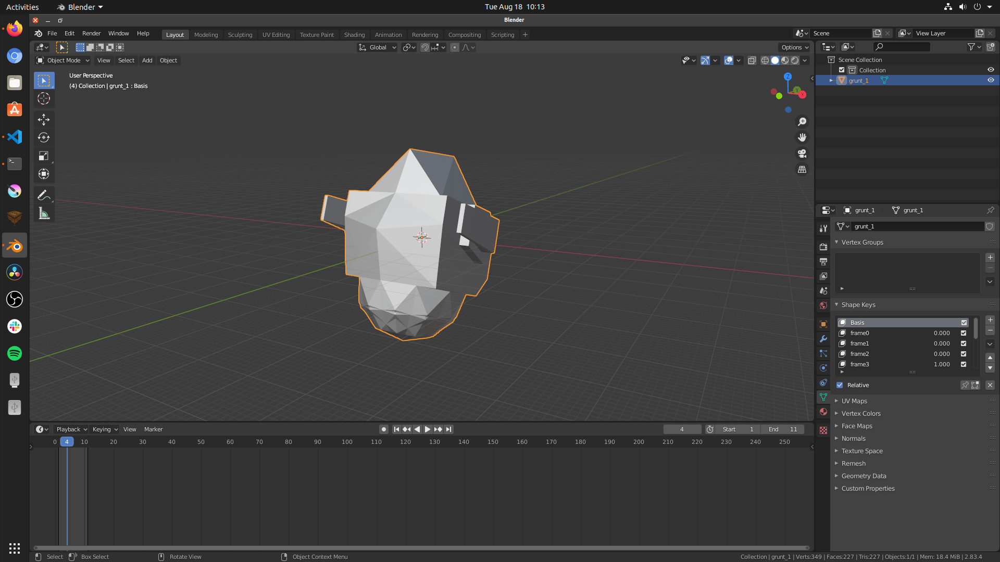

# Blender Quake MDL Import / Export

(Works with blender 2.93)

This is a plugin for [Blender][1] 2.8 that gives the basic ability to import and export models in the Quake 1 and Hexen MDL format.

This plugin was originally authored by Bill Currie and Aleksander Marhall, and they had the license in the source files.

I don't know where I found this originally. I just had it sitting on a drive and kept losing it. I thought I'd put it on
github so I can find it, and also, maybe, it'd help out some mod'ers or people building basic game engines.



## Installation

You should be able to:

- download the source as a zip using the `Code > Download Zip` button above.
- Inside blender, choose `Edit > Preferences > Add-ons > Install`
- Browse to the downloaded zip file; click install
- Find io_mesh_qfmdl and check activate

You should then see `Quake 1` from Blenders normal import and export menu.

## Animations

Since there are no bones or rigging in MDL files, each frame is loaded as (or exported from) a `Shape Key` (check the blender documentation) for how this works.

## Original TODOs

```
X   auto-convert quads/ngons to tris
o   combine multiple selected meshes into one mdl
    ?   active object determines origin?
    ?   non-active objects' meshes rotated relative to active? all objects
        relative to world?
o   bake image textures to the mdl
    ?   how to handle overlapping UVs?
```

[1]: https://www.blender.org/
